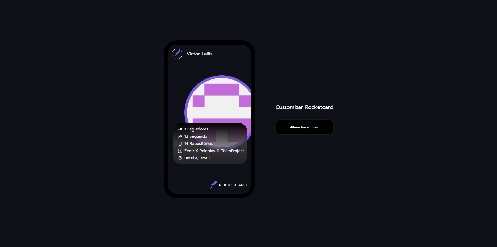

# Rocketcard RocketSeat

- Rocketcard challenge proposed by Rocketseat.

## 🔧 Functions

### Github profile on card:
- Get public informations from a Github profile and show in the card.

## Made with:

---

Made with 💜 by Victor Lellis
