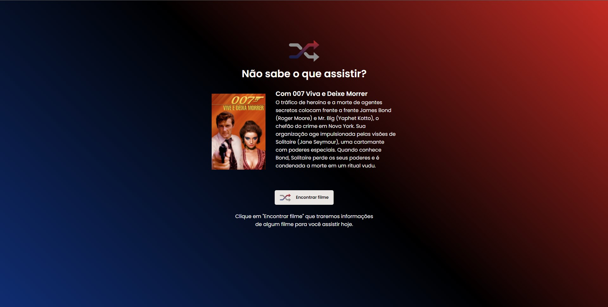

# Countdown RocketSeat




- Rocketflix challenge proposed by Rocketseat.

## 🔧 Functions

### Get a movie:
- Get a random movie from "themoviedb" API and displays title, overview and poster.

## Made with:
[](https://www.typescriptlang.org/)
[](https://sass-lang.com/)
[](https://reactjs.org/)
[](https://vitejs.dev/)

## 🚀 Getting started

Clone the project and access the folder.

Follow the steps below:
```bash
# Install the dependencies
$ yarn or npm i
# Start the project
$ yarn start or npm run dev
```
The app will be available for access on your browser at http://localhost:3000

---

<p align="center">Made with 💜 by Victor Lellis</p>